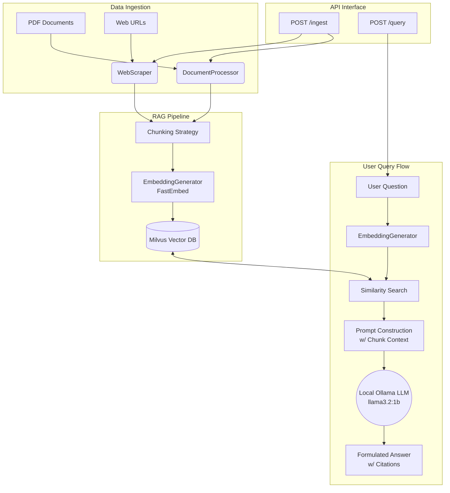

# AI Research Assistant

A Production-Ready AI Research Assistant utilizing a robust Retrieval Augmented Generation (RAG) pipeline to ingest complex data and answer domain-specific questions with contextual citations. 

## 🏗️ Architecture

The system follows a classic RAG architecture powered by modern, un-opinionated AI components and served via FastAPI.



## 🧠 Research & Decision Making

### 1. Vector Database Selection: Milvus
**Why Milvus?** We selected Milvus (via `pymilvus` Lite) because it seamlessly handles highly scalable vector searching. For local development pipelines, Milvus Lite allows testing the full Milvus vector capability directly using local disk files without provisioning Docker containers, eliminating friction. However, it requires ZERO code changes to scale to a cloud-native, distributed Milvus cluster in production.
*Trade-offs:* While simpler embedded DBs like Chroma may be temporarily easier, Milvus offers superior production scalability.

### 2. Chunking Strategy
**Why this approach?** Our system uses a hybrid overlap strategy. Documents are broken down sequentially into token-adjusted character limits (typically ~1000 characters base). Specifically, we rely on semantic structural boundaries (like newlines and paragraphs using PyMuPDF) while enforcing a 20% overlap strategy. 
*Trade-offs:* This requires slightly more vector storage space (due to overlapping sequences) but drastically reduces the risk of cutting off a concept halfway, preserving the semantic meaning needed for reliable embedding cosine retrieval.

### 3. Embedding Model Selection: FastEmbed
**Why FastEmbed?** We use Qdrant's `fastembed` library to generate vector embeddings using optimal lightweight models locally (e.g. `BAAI/bge-small-en-v1.5`). It generates embeddings fully on the CPU without spinning up heavyweight PyTorch instances, utilizing ONNX runtime.
*Trade-offs:* Using an API-based embedding (like OpenAI `text-embedding-3-small`) guarantees slightly better multi-lingual semantic alignment out of the box, however, relying on an entirely local FastEmbed generator completely eliminates embedding API costs, making infinite document ingestions sustainably cheap.

### 4. Language Model (LLM): Local Ollama (llama3.2:1b)
**Why Ollama?** We selected a fully local deployment using Ollama and `llama3.2:1b` to ensure complete data privacy and zero API costs. The pipeline connects to a background daemon serving the model fast and locally.
*Trade-offs:* Running locally requires sufficient host hardware (RAM/Compute) and has slightly lower reasoning capability compared to a behemoth model like GPT-4o, but for RAG tasks where the prompt contains the answers, `llama3.2:1b` provides an optimal speed-to-accuracy ratio.

### 5. Backend Architecture: FastAPI + Headless Playwright
**Why FastAPI?** FastAPI natively supports asynchronous execution and auto-generates structural OpenAPI documentation. The ingestion endpoints concurrently stream bulky files and handle requests. We also paired it with Playwright browsers to dynamically bypass bot-protections (like Cloudflare) during URL scraping asynchronously.

## 🛠️ Tech Stack summary
- **Backend:** Python, FastAPI, Uvicorn
- **Vector DB:** Milvus (pymilvus Lite)
- **Embeddings:** FastEmbed (`bge-small-en-v1.5`)
- **Generative AI:** Ollama (`llama3.2:1b`)
- **Scraping:** BeautifulSoup4, Playwright

## 🚀 Setup Instructions

1. **Clone the repository.**
2. **Install the dependencies using `uv` or `pip`:**
   ```bash
   uv pip install -r requirements.txt
   ```
3. **Environment Setup:** Local variables in `.env` (Optional but recommended to override defaults):
   ```env
   OLLAMA_MODEL="llama3.2:1b"
   OLLAMA_BASE_URL="http://localhost:11434"
   ```

4. **Run the Backend API:**
   ```bash
   uvicorn main:app --reload
   ```
   *The backend will be available at `http://127.0.0.1:8000`. You can visit `http://127.0.0.1:8000/docs` to test endpoints via the interactive Swagger UI.*

## 🛠️ API Usage (Postman / cURL examples)

### 1. Health Check
```bash
curl -X GET http://127.0.0.1:8000/health
```

### 2. Ingest Data (URL)
```bash
curl -X POST http://127.0.0.1:8000/ingest \
  -F "url=https://en.wikipedia.org/wiki/OpenAI"
```

### 3. Ingest Data (PDF File)
```bash
curl -X POST http://127.0.0.1:8000/ingest \
  -F "file=@/path/to/your/document.pdf"
```

### 4. Query System
```bash
curl -X POST http://127.0.0.1:8000/query \
  -H "Content-Type: application/json" \
  -d '{"query": "What is OpenAI?"}'
```

## 🛑 Limitations & 🔮 Future Improvements

**Limitations:**
- Currently, similarity search uses pure Cosine Vector Similarity. It might struggle with highly-specific keyword matches or IDs where traditional TF-IDF excels.
- RAG generation context size is statically capped. Massive scale queries that require reading 100+ document chunks may exceed LLM token context windows.

**Future Improvements:**
1. **Hybrid Search (Keyword + Vector):** Implement BM25 lexical search layered with vector search and pass results through a Cross-Encoder Re-ranker.
2. **Streaming Responses:** Stream generative tokens directly to the client instead of blocking until the answer resolves.
3. **Guardrails & Hallucination Checking:** Intercept answers with an automated evaluation loop determining if the LLM hallucinated facts absent from the queried chunks before returning.
